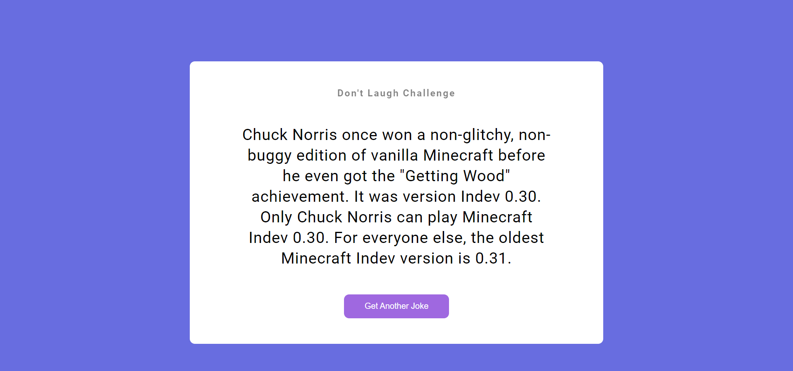

# JavaScript Project - Random Jokes Generator

## **Project: Random Jokes Generator**

### Concepts learned from this project:
- Learned about generating random jokes from API using fetch.
- API used is Chuck Norris Jokes API.

**Live Link :** [Deployed Link](https://js-project-randomjokes.netlify.app/)
>### Preview :

